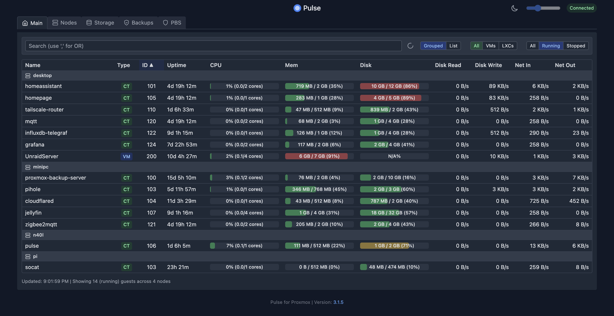

#  Pulse for Proxmox VE

[](https://github.com/rcourtman/Pulse/releases/latest)
[](LICENSE)
[](https://hub.docker.com/r/rcourtman/pulse)

A lightweight monitoring application for Proxmox VE that displays real-time status for VMs and containers via a simple web interface.



[](https://ko-fi.com/rcourtman)

## 📋 Table of Contents
- [Configuration](#️-configuration)
  - [Environment Variables](#environment-variables)
  - [Creating a Proxmox API Token](#creating-a-proxmox-api-token)
  - [Required Permissions](#required-permissions)
- [Installation](#-installation)
- [Running the Application](#-running-the-application)
- [Running the Application (Node.js)](#️-running-the-application-nodejs)
- [Running with Docker Compose](#-running-with-docker-compose)
- [Running with LXC Installation Script](#-running-with-lxc-installation-script)
- [Features](#-features)
- [System Requirements](#-system-requirements)
- [Contributing](#-contributing)
- [License](#-license)
- [Trademark Notice](#trademark-notice)
- [Support](#-support)

## 🛠️ Configuration

### Environment Variables

1.  **Copy Example File:** This application requires environment variables for configuration. Copy the example environment file from `server/.env.example` to `server/.env`.

    ```bash
    cp server/.env.example server/.env
    ```

2.  **Edit `.env`:** Open `server/.env` in a text editor and update the values for your Proxmox environment, including the Host, Token ID, and Token Secret obtained below.

    The following variables are available:
    - `PROXMOX_HOST`: URL of your Proxmox server (e.g., `https://your-proxmox-ip:8006`).
    - `PROXMOX_TOKEN_ID`: Your API Token ID (e.g., `user@pam!tokenid`).
    - `PROXMOX_TOKEN_SECRET`: Your API Token Secret.
    - `PROXMOX_ALLOW_SELF_SIGNED_CERTS`: (Optional) Set to `true` if your Proxmox server uses self-signed SSL certificates. Defaults to `false`.
    - `PORT`: (Optional) Port for the Pulse server to listen on. Defaults to `7655`.
    - `PROXMOX_USERNAME`, `PROXMOX_PASSWORD`, `PROXMOX_REALM`: (Optional) Fallback credentials if API token is not provided.

    ***Note:** Even if you have a Proxmox cluster, you only need to provide the connection details (`PROXMOX_HOST`, token, etc.) for **one** node in the cluster. Pulse will automatically discover and fetch data from the other nodes.*\n

    **Monitoring Multiple Proxmox Environments (Optional):**

    To monitor multiple, separate Proxmox environments (e.g., different clusters or standalone nodes at different sites) within the same Pulse interface, you can define additional endpoints using numbered environment variables. Pulse will automatically detect and connect to these if they are configured:

    - `PROXMOX_HOST_2`, `PROXMOX_TOKEN_ID_2`, `PROXMOX_TOKEN_SECRET_2`: Connection details for the second environment.
    - `PROXMOX_HOST_3`, `PROXMOX_TOKEN_ID_3`, `PROXMOX_TOKEN_SECRET_3`: Connection details for the third environment.
    - ...and so on.

    You can also use the corresponding optional variables for each numbered endpoint (e.g., `PROXMOX_ALLOW_SELF_SIGNED_CERTS_2`, `PROXMOX_PORT_2`, `PROXMOX_NODE_NAME_2`, `PROXMOX_USERNAME_2`, `PROXMOX_PASSWORD_2`, `PROXMOX_REALM_2`).

    If you only need to monitor a single Proxmox cluster or node, you only need to set the primary variables (`PROXMOX_HOST`, `PROXMOX_TOKEN_ID`, `PROXMOX_TOKEN_SECRET`).

### Creating a Proxmox API Token

An API token is recommended for connecting Pulse to Proxmox.

1.  **Log in to the Proxmox web interface**

2.  **Create a dedicated user** (optional but recommended for security)
    *   Go to `Datacenter` → `Permissions` → `Users`.
    *   Click `Add`.
    *   Enter a `User name` (e.g., "pulse-monitor"), set Realm to `Proxmox VE authentication server`, set a password, and ensure `Enabled` is checked. Click `Add`.

3.  **Create an API token**
    *   Go to `Datacenter` → `Permissions` → `API Tokens`.
    *   Click `Add`.
    *   Select the `User` you created (e.g., "pulse-monitor@pam") or `root@pam`.
    *   Enter a `Token ID` (e.g., "pulse").
    *   Leave `Privilege Separation` checked (more secure).
    *   Click `Add`.
    *   **Important:** Copy the displayed `Secret` value immediately and store it securely. It will only be shown once.

4.  **Assign permissions (to both User and Token)**
    *   Go to `Datacenter` → `Permissions`.
    *   **First, add permission for the User:**
        *   Click `Add` → `User Permission`.
        *   Path: `/`
        *   User: Select the user you created (e.g., "pulse-monitor@pam").
        *   Role: `PVEAuditor` (provides read-only access).
        *   Ensure `Propagate` is checked.
        *   Click `Add`.
    *   **Second, add permission for the API Token:**
        *   Click `Add` → `API Token Permission`.
        *   Path: `/`
        *   API Token: Select the token you created (e.g., "pulse-monitor@pam!pulse").
        *   Role: `PVEAuditor`.
        *   Ensure `Propagate` is checked.
        *   Click `Add`.

    *Note: Assigning the `PVEAuditor` role at the root path (`/`) with `Propagate` checked is crucial for Pulse to discover and monitor all nodes, VMs, containers, and storage in your cluster.*

5.  **Update your `server/.env` file** with the `Token ID` (which looks like `user@realm!tokenid`, e.g., `pulse-monitor@pam!pulse`) and the `Secret` you saved.

### Required Permissions

The `PVEAuditor` role is recommended as it provides the necessary read-only permissions for Pulse to monitor your Proxmox environment:
- `Datastore.Audit`
- `Permissions.Read` (implicitly included)
- `Pool.Audit`
- `Sys.Audit`
- `VM.Audit`

## 💾 Installation

Navigate to the project root directory and install the necessary Node.js dependencies.

```bash
# Install root dependencies
npm install
```

You also need to install dependencies for the server component:

```bash
# Install server dependencies
cd server
npm install
cd ..
```

## ▶️ Running the Application (Node.js)

These instructions are for running the application directly using Node.js.

### Development Mode

To run the application in development mode (useful for testing changes):

```bash
npm run dev
```
This command starts the server, typically using `nodemon` or similar for automatic restarts on file changes. Check the terminal output for the URL (e.g., `http://localhost:7655`).

### Production Mode

To run the application normally:

```bash
npm run start
```
This command starts the server using `node`. Access the application via the configured host and port.

## 🐳 Running with Docker Compose

Using Docker Compose is the recommended way to run the application in a containerized environment.

**Prerequisites:**
- Docker ([Install Docker](https://docs.docker.com/engine/install/))
- Docker Compose ([Install Docker Compose](https://docs.docker.com/compose/install/))

**Steps:**

1.  **Configure Environment:** Ensure you have created and configured your `server/.env` file as described in the [Environment Variables](#environment-variables) section above.

2.  **Run:** Navigate to the project root directory in your terminal and run:
    ```bash
    docker compose up -d
    ```
    - This command will download the pre-built `rcourtman/pulse:latest` image from Docker Hub (if not already present) and start the container.
    - `-d`: Runs the container in detached mode (in the background).

3.  **Access:** The application should now be running. Access it via `http://<your-host-ip>:7655` (or the host port you mapped in `docker-compose.yml`).

**Stopping the Application:**

To stop the container(s) defined in the `docker-compose.yml` file, run:

```bash
docker compose down
```

*Note: If you modify the `server/.env` file after the container is already running, you may need to restart the container for the changes to take effect. You can do this by running `docker compose down` followed by `docker compose up -d`, or by using `docker compose up -d --force-recreate`.*

### Alternative: Quick Start with Inline Variables

If you prefer not to use a separate `.env` file, you can define the environment variables directly within a `docker-compose.yml` file. This is useful for a quick test or simple deployments.

1.  Save the following content as `docker-compose.yml`.
2.  **Replace the placeholder values** for `PROXMOX_HOST`, `PROXMOX_TOKEN_ID`, and `PROXMOX_TOKEN_SECRET` with your actual Proxmox credentials.
3.  Run `docker compose up -d` in the same directory as the file.
4.  Access the dashboard at `http://<your-host-ip>:7655`.

```yaml
version: '3.8'

services:
  pulse:
    image: rcourtman/pulse:latest
    container_name: pulse_monitor
    restart: unless-stopped
    ports:
      - "7655:7655" # Map container port 7655 to host port 7655
    environment:
      # --- Required Proxmox Connection Details ---
      # Replace placeholders with your actual values
      PROXMOX_HOST: "https://your-proxmox-ip-or-hostname:8006"
      PROXMOX_TOKEN_ID: "your-user@pam!your-token-name"
      PROXMOX_TOKEN_SECRET: "your-api-token-secret-uuid"

      # --- Optional Settings ---
      # Set to "true" if your Proxmox uses self-signed SSL certificates
      PROXMOX_ALLOW_SELF_SIGNED_CERTS: "false"
      # Define additional endpoints if needed (PROXMOX_HOST_2, etc.)
      # PROXMOX_HOST_2: "https://other-proxmox-ip:8006"
      # PROXMOX_TOKEN_ID_2: "user2@pam!token2"
      # PROXMOX_TOKEN_SECRET_2: "secret-uuid-2"

    # Optional: Mount a local directory for potential future config needs
    # volumes:
    #   - ./pulse_config:/config

networks:
  default:
    driver: bridge
```

## 🚀 Running with LXC Installation Script

For installation within a Proxmox VE LXC container, a convenient script is provided to set up Pulse inside an **existing** LXC container (Debian/Ubuntu based). This script automates dependency installation, configuration, and setting up a systemd service.

**Prerequisites:**
- A running Proxmox VE environment.
- A Debian or Ubuntu based LXC container already created in Proxmox.
    - *Tip: Creating a suitable LXC container is easy using helper scripts. For example, the [Community Scripts](https://community-scripts.github.io/ProxmoxVE/scripts?id=debian) collection offers a Debian script you can run directly on your Proxmox host:*
      ```bash
      bash -c "$(curl -fsSL https://raw.githubusercontent.com/community-scripts/ProxmoxVE/main/ct/debian.sh)"
      ```
- Network connectivity from the LXC to your Proxmox server.

**Steps:**

1.  **Access LXC Console:** Log in to the console of your existing LXC container (e.g., via the Proxmox web UI or SSH). You should typically be logged in as `root`.

2.  **Download and Run the Script:** The recommended way is to download the script first, make it executable, and then run it. This allows interaction with prompts for configuration and optional features like automatic updates.
    ```bash
    # Ensure you are in a suitable directory, like /root or /tmp
    curl -sLO https://raw.githubusercontent.com/rcourtman/Pulse/main/scripts/install-pulse.sh
    chmod +x install-pulse.sh
    ./install-pulse.sh
    ```
    *(The older method of piping directly to `bash` using `wget` or `curl` might still work for initial installs but will skip interactive prompts like the automatic update setup.)*

3.  **Follow Prompts:** The script will guide you through the installation process:
    *   It will update the container and install necessary packages (`git`, `curl`, `nodejs`, `npm`, `gpg`, `sudo`).
    *   It will guide you through creating the required Proxmox API Token if needed.
    *   It will ask for your Proxmox Host URL, API Token ID, and API Token Secret.
    *   It will ask about allowing self-signed certificates and optionally setting a custom port.
    *   It will configure Pulse and set it up as a `systemd` service (`pulse-monitor.service`) to run automatically.
    *   **Automatic Updates (Optional):** After a successful installation or update, the script will ask if you want to enable automatic updates (Daily, Weekly, or Monthly) via a cron job.

4.  **Access Pulse:** Once the script finishes, it will display the URL (using the LXC's IP address) where you can access the Pulse dashboard (e.g., `http://<LXC-IP-ADDRESS>:7655`).

**Updating Pulse:**

To update Pulse to the latest version, simply re-run the script from the same directory where you downloaded it:

```bash
./install-pulse.sh
```
The script will detect the existing installation and offer to update it.

**Non-Interactive Updates:**

You can also run the update non-interactively using the `--update` flag. This is useful for scripting or if used in the cron job for automatic updates:

```bash
./install-pulse.sh --update
```

**Automatic Update Details:**

If you enable automatic updates via the script prompt:
- A cron job is added to the `root` user's crontab.
- The job runs `./install-pulse.sh --update` according to the chosen schedule (Daily, Weekly, Monthly).
- Output (including any errors) from the update process is logged to `/var/log/pulse_update.log`.
- You can view the root crontab using `sudo crontab -l -u root` and edit it using `sudo crontab -e -u root`.

**Managing the Pulse Service**

Once installed, the Pulse application runs as a `systemd` service. You can manage it using standard `systemctl` commands:

*   **Check Status:** `sudo systemctl status pulse-monitor.service`
*   **Stop Service:** `sudo systemctl stop pulse-monitor.service`
*   **Start Service:** `sudo systemctl start pulse-monitor.service`
*   **View Logs:** `sudo journalctl -u pulse-monitor.service -f`
*   **Enable on Boot (usually done by script):** `sudo systemctl enable pulse-monitor.service`
*   **Disable on Boot:** `sudo systemctl disable pulse-monitor.service`

## ✨ Features

- Lightweight monitoring for Proxmox VE nodes.
- Displays real-time status for VMs and Containers via WebSocket updates.
- Simple, responsive web interface.
- Efficient polling: Stops polling the Proxmox API when no clients (browsers) are connected, reducing load.
- Docker support for easy deployment.
- Support for monitoring multiple distinct Proxmox environments.
- Monitoring support for Proxmox Backup Server (PBS) instances (configured as additional endpoints).
- LXC installation script for easy setup.

## 💻 System Requirements

- **Node.js:** Version 18.x or later recommended.
- **NPM:** Compatible version with Node.js.
- **Docker & Docker Compose:** Latest stable versions recommended if using container deployment.
- **Proxmox VE:** Version 7.x or 8.x recommended (tested primarily on 8.x).
- **Web Browser:** Modern evergreen browser (Chrome, Firefox, Edge, Safari).

## 👋 Contributing

Contributions are welcome! Please read our [Contributing Guidelines](CONTRIBUTING.md) before submitting pull requests or opening issues.

## 📜 License

This project is licensed under the MIT License - see the [LICENSE](LICENSE) file for details.

## ™️ Trademark Notice

Proxmox® and Proxmox VE® are registered trademarks of Proxmox Server Solutions GmbH. This project is not affiliated with or endorsed by Proxmox Server Solutions GmbH.

## ❤️ Support

If you encounter any issues or have questions, please file an issue on the [GitHub repository](https://github.com/rcourtman/Pulse/issues).

If you find this project useful, consider supporting its development:

[](https://ko-fi.com/rcourtman)