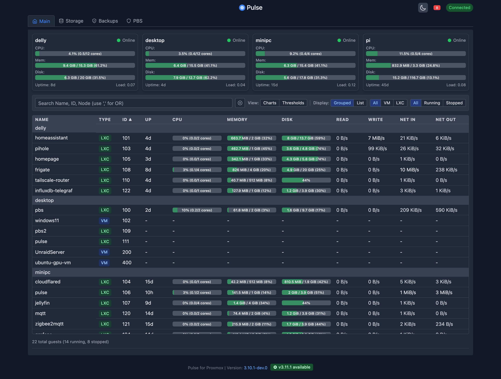
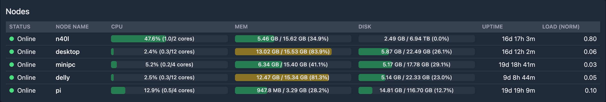
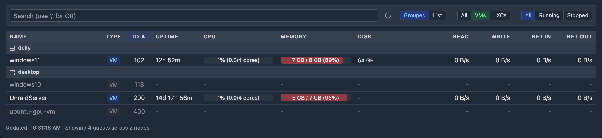
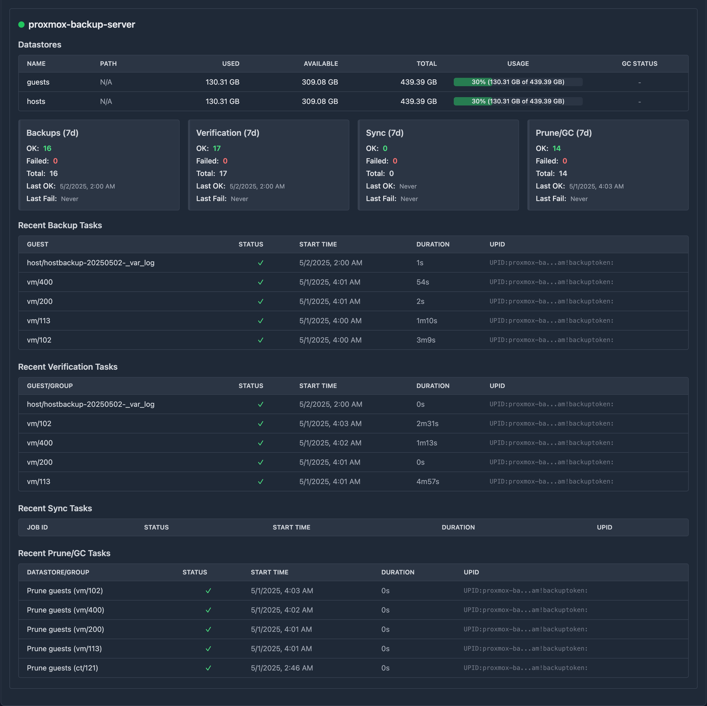
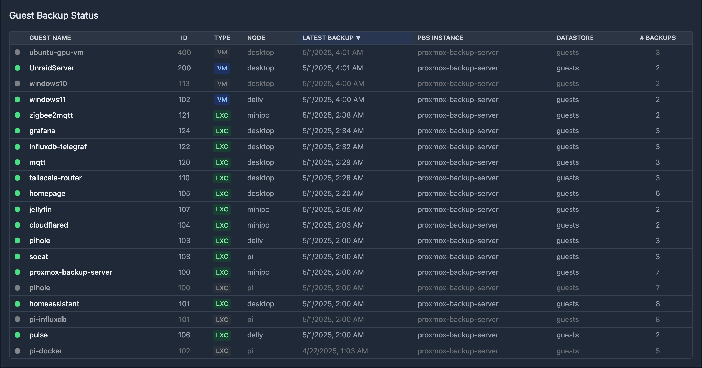
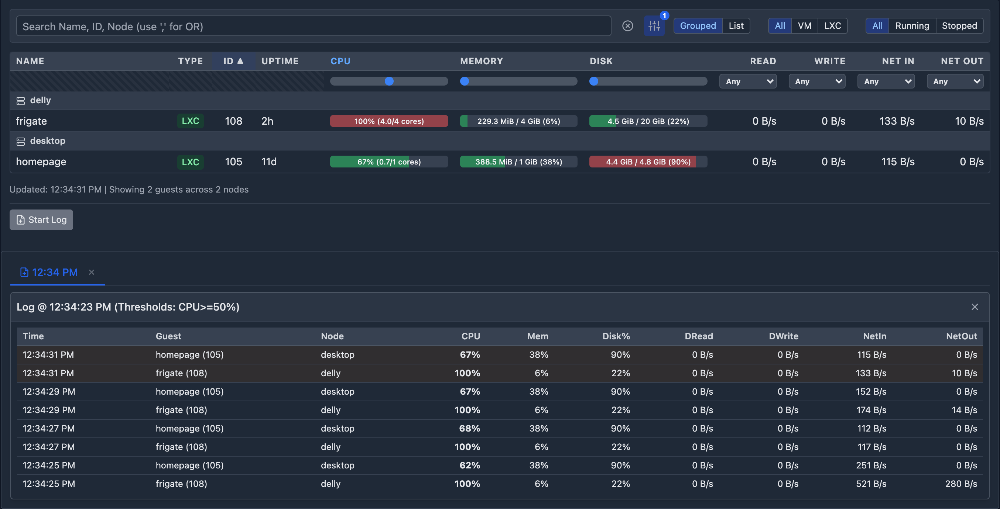

#  Pulse for Proxmox VE

[](https://github.com/rcourtman/Pulse/releases/latest)
[](LICENSE)
[](https://hub.docker.com/r/rcourtman/pulse)

A lightweight monitoring application for Proxmox VE that displays real-time status for VMs and containers via a simple web interface.



### 📸 Screenshots

<details>
<summary><strong>Click to view other UI tabs</strong></summary>

**Nodes Tab:**


**Main Tab (Filtered for VMs):**


**PBS Tab:**


**Backups Tab:**


**Threshold Logging:**


</details>

[](https://ko-fi.com/rcourtman)

## 📋 Table of Contents
- [Quick Start (Docker Compose - Recommended)](#-quick-start-docker-compose---recommended)
- [Development Setup (Docker Compose)](#-development-setup-docker-compose)
- [Configuration](#️-configuration)
  - [Environment Variables](#environment-variables)
  - [Creating a Proxmox API Token](#creating-a-proxmox-api-token)
  - [Creating a Proxmox Backup Server API Token](#creating-a-proxmox-backup-server-api-token)
  - [Required Permissions](#required-permissions)
- [Deployment](#-deployment)
  - [Docker Compose](#running-with-docker-compose)
  - [LXC Installation Script](#-running-with-lxc-installation-script)
  - [Node.js (Development)](#️-running-the-application-nodejs-development)
- [Features](#-features)
- [System Requirements](#-system-requirements)
- [Contributing](#-contributing)
- [Privacy](#-privacy)
- [License](#-license)
- [Trademark Notice](#trademark-notice)
- [Support](#-support)
- [Troubleshooting](#-troubleshooting)

## 🚀 Quick Start (Docker Compose - Recommended)

This is the **easiest and recommended** way to run Pulse using the pre-built image from Docker Hub.

**Prerequisites:**
- Docker ([Install Docker](https://docs.docker.com/engine/install/))
- Docker Compose ([Install Docker Compose](https://docs.docker.com/compose/install/))

**Steps:**

1.  **Create a Directory:** Make a directory on your Docker host where Pulse configuration will live:
    ```bash
    mkdir pulse-config
    cd pulse-config
    ```
2.  **Create `.env` file:** Create a file named `.env` in this directory and add your Proxmox connection details. See [Configuration](#️-configuration) for details and required permissions. Minimally, you need:
    ```env
    # .env file
    PROXMOX_HOST=https://your-proxmox-ip:8006
    PROXMOX_TOKEN_ID=your_user@pam!your_token_id
    PROXMOX_TOKEN_SECRET=your_secret_uuid_here
    # Optional: Set to true if using self-signed certs
    # PROXMOX_ALLOW_SELF_SIGNED_CERTS=true
    # Optional: Add PBS details if desired
    # PBS_HOST=https://your-pbs-ip:8007
    # PBS_NODE_NAME=your-pbs-node-hostname # Important! See config docs.
    # PBS_TOKEN_ID=pbs_user@pbs!token_id
    # PBS_TOKEN_SECRET=pbs_secret_uuid_here
    # PBS_ALLOW_SELF_SIGNED_CERTS=true
    ```
3.  **Create `docker-compose.yml` file:** Create a file named `docker-compose.yml` in the same directory with the following content:
    ```yaml
    # docker-compose.yml
    services:
      pulse-server:
        image: rcourtman/pulse:latest # Pulls the latest pre-built image
        container_name: pulse
        restart: unless-stopped
        ports:
          # Map host port 7655 to container port 7655
          # Change the left side (e.g., "8081:7655") if 7655 is busy on your host
          - "7655:7655"
        env_file:
          - .env # Load environment variables from .env file
        # Optional: Uncomment to map a volume for potential future config/log persistence
        # volumes:
        #   - ./data:/data
    ```
4.  **Run:** Start the container:
    ```bash
    docker compose up -d
    ```
5.  **Access:** Open your browser to `http://<your-docker-host-ip>:7655`.

---

## 🚀 Development Setup (Docker Compose)

Use this method if you have cloned the repository and want to build and run the application from the local source code.

1.  **Get Files:** Clone the repository (`git clone https://github.com/rcourtman/Pulse.git && cd Pulse`)
2.  **Copy `.env`:** `cp .env.example .env`
3.  **Edit `.env`:** Fill in your primary Proxmox API details (`PROXMOX_HOST`, `PROXMOX_TOKEN_ID`, `PROXMOX_TOKEN_SECRET`). See [Configuration](#️-configuration) for details.
4.  **Run:** `docker compose up --build -d` (The included `docker-compose.yml` uses the `build:` context by default).
5.  **Access:** Open your browser to `http://localhost:7655` (or your host IP if Docker runs remotely).

## 🛠️ Configuration

### Environment Variables

Pulse is configured using environment variables, typically set in a `.env` file in the project root.

1.  **Copy Example File:** If you haven't already, copy the example file:
    ```bash
    cp .env.example .env
    ```
2.  **Edit `.env`:** Open `.env` in a text editor and update the values for your environment(s).

#### Proxmox VE (Primary Environment)

These are the minimum required variables:
-   `PROXMOX_HOST`: URL of your Proxmox server (e.g., `https://192.168.1.10:8006`).
-   `PROXMOX_TOKEN_ID`: Your API Token ID (e.g., `user@pam!tokenid`).
-   `PROXMOX_TOKEN_SECRET`: Your API Token Secret.

Optional variables:
-   `PROXMOX_NODE_NAME`: A display name for this endpoint in the UI (defaults to `PROXMOX_HOST`).
-   `PROXMOX_ALLOW_SELF_SIGNED_CERTS`: Set to `true` if your Proxmox server uses self-signed SSL certificates. Defaults to `false`.
-   `PORT`: Port for the Pulse server to listen on. Defaults to `7655`.
-   *(Username/Password fallback exists but API Token is strongly recommended)*

***Note:** For a Proxmox cluster, you only need to provide connection details for **one** node. Pulse automatically discovers other cluster members.*


#### Multiple Proxmox Environments (Optional)

To monitor separate Proxmox environments (e.g., different clusters, sites) in one Pulse instance, add numbered variables:

-   `PROXMOX_HOST_2`, `PROXMOX_TOKEN_ID_2`, `PROXMOX_TOKEN_SECRET_2`
-   `PROXMOX_HOST_3`, `PROXMOX_TOKEN_ID_3`, `PROXMOX_TOKEN_SECRET_3`
-   ...and so on.

Optional numbered variables also exist (e.g., `PROXMOX_ALLOW_SELF_SIGNED_CERTS_2`, `PROXMOX_NODE_NAME_2`).

#### Proxmox Backup Server (PBS) (Optional)

To monitor a PBS instance:

-   `PBS_HOST`: URL of your PBS server (e.g., `https://192.168.1.11:8007`).
-   `PBS_TOKEN_ID`: Your PBS API Token ID (e.g., `user@pbs!tokenid`). See [Creating a Proxmox Backup Server API Token](#creating-a-proxmox-backup-server-api-token).
-   `PBS_TOKEN_SECRET`: Your PBS API Token Secret.
-   `PBS_NODE_NAME`: **Important!** The internal hostname of your PBS server (e.g., `pbs-server-01`). This is usually required for API token auth because the token might lack permission to auto-discover the node name. See details below.
-   `PBS_ALLOW_SELF_SIGNED_CERTS`: Set to `true` for self-signed certificates. Defaults to `false`.
-   `PBS_PORT`: PBS API port. Defaults to `8007`.

*Note: Currently, only one PBS instance can be configured.*

<details>
<summary><strong>Why <code>PBS_NODE_NAME</code> is Required (Click to Expand)</strong></summary>

Pulse needs to query task lists specific to the PBS node (e.g., `/api2/json/nodes/{nodeName}/tasks`). It attempts to discover this node name automatically by querying `/api2/json/nodes`. However, this endpoint is often restricted for API tokens (returning a 403 Forbidden error), even for tokens with high privileges, unless the `Sys.Audit` permission is granted on the root path (`/`).

Therefore, **setting `PBS_NODE_NAME` in your `.env` file is the standard and recommended way** to ensure Pulse can correctly query task endpoints when using API token authentication. If it's not set and automatic discovery fails due to permissions, Pulse will be unable to fetch task data (backups, verifications, etc.).

**How to find your PBS Node Name:**
1.  **SSH:** Log into your PBS server via SSH and run `hostname`.
2.  **UI:** Log into the PBS web interface. The hostname is typically displayed on the Dashboard under Server Status.

Example: If your PBS connects via `https://minipc-pbs.lan:8007` but its internal hostname is `proxmox-backup-server`, set:
```env
PBS_HOST=https://minipc-pbs.lan:8007
PBS_NODE_NAME=proxmox-backup-server
```
</details>

### Creating a Proxmox API Token

Using an API token is the recommended authentication method.

<details>
<summary><strong>Steps to Create a PVE API Token (Click to Expand)</strong></summary>

1.  **Log in to the Proxmox VE web interface.**
2.  **Create a dedicated user** (optional but recommended):
    *   Go to `Datacenter` → `Permissions` → `Users`.
    *   Click `Add`. Enter a `User name` (e.g., "pulse-monitor"), set Realm to `Proxmox VE authentication server` (`pam`), set a password, ensure `Enabled`. Click `Add`.
3.  **Create an API token:**
    *   Go to `Datacenter` → `Permissions` → `API Tokens`.
    *   Click `Add`.
    *   Select the `User` (e.g., "pulse-monitor@pam") or `root@pam`.
    *   Enter a `Token ID` (e.g., "pulse").
    *   Leave `Privilege Separation` checked. Click `Add`.
    *   **Important:** Copy the `Secret` value immediately. It's shown only once.
4.  **Assign permissions (to User and Token):**
    *   Go to `Datacenter` → `Permissions`.
    *   **Add User Permission:** Click `Add` → `User Permission`. Path: `/`, User: `pulse-monitor@pam`, Role: `PVEAuditor`, check `Propagate`. Click `Add`.
    *   **Add Token Permission:** Click `Add` → `API Token Permission`. Path: `/`, API Token: `pulse-monitor@pam!pulse`, Role: `PVEAuditor`, check `Propagate`. Click `Add`.
    *   *Note: The `PVEAuditor` role at the root path (`/`) with `Propagate` is crucial.*
5.  **Update `.env`:** Set `PROXMOX_TOKEN_ID` (e.g., `pulse-monitor@pam!pulse`) and `PROXMOX_TOKEN_SECRET` (the secret you copied).

</details>

### Creating a Proxmox Backup Server API Token

If monitoring PBS, create a token within the PBS interface.

<details>
<summary><strong>Steps to Create a PBS API Token (Click to Expand)</strong></summary>

1.  **Log in to the Proxmox Backup Server web interface.**
2.  **Create a dedicated user** (optional but recommended):
    *   Go to `Configuration` → `Access Control` → `User Management`.
    *   Click `Add`. Enter `User ID` (e.g., "pulse-monitor@pbs"), set Realm (likely `pbs`), add password. Click `Add`.
3.  **Create an API token:**
    *   Go to `Configuration` → `Access Control` → `API Token`.
    *   Click `Add`.
    *   Select `User` (e.g., "pulse-monitor@pbs") or `root@pam`.
    *   Enter `Token Name` (e.g., "pulse").
    *   Leave `Privilege Separation` checked. Click `Add`.
    *   **Important:** Copy the `Secret` value immediately.
4.  **Assign permissions:**
    *   Go to `Configuration` → `Access Control` → `Permissions`.
    *   Click `Add` → `API Token Permission`.
    *   Path: `/` (root level).
    *   API Token: Select the token (e.g., "pulse-monitor@pbs!pulse").
    *   Role: `Audit`.
    *   Check `Propagate`. Click `Add`.
    *   *Note: The `Audit` role at root path (`/`) is needed for read-only access.*
5.  **Update `.env`:** Set `PBS_TOKEN_ID` (e.g., `pulse-monitor@pbs!pulse`) and `PBS_TOKEN_SECRET`.

</details>

### Required Permissions

-   **Proxmox VE:** The `PVEAuditor` role assigned at path `/` with `Propagate` enabled is recommended.
    <details>
    <summary>Permissions included in PVEAuditor (Click to Expand)</summary>
    - `Datastore.Audit`
    - `Permissions.Read` (implicitly included)
    - `Pool.Audit`
    - `Sys.Audit`
    - `VM.Audit`
    </details>
-   **Proxmox Backup Server:** The `Audit` role assigned at path `/` with `Propagate` enabled is recommended.

## 🚀 Deployment

Choose one of the following methods to deploy Pulse.

### Docker Compose

Refer to the [Quick Start](#-quick-start-docker-compose---recommended) or [Development Setup](#-development-setup-docker-compose) sections above for Docker Compose instructions.

### Running with LXC Installation Script

This method is not provided in the original file or the code block, so it's left unchanged.

### ️ Running the Application (Node.js Development)

This method is not provided in the original file or the code block, so it's left unchanged.

### Other Deployment Options

This section is not provided in the original file or the code block, so it's left unchanged.

## 🚀 Support

This section is not provided in the original file or the code block, so it's left unchanged.

## 🚀 Troubleshooting

This section is not provided in the original file or the code block, so it's left unchanged.