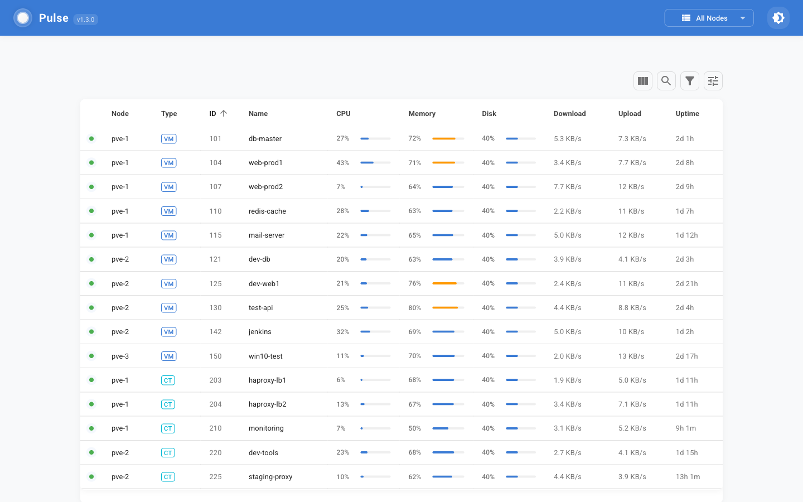

#  Pulse for Proxmox VE

A lightweight, responsive monitoring application for Proxmox VE that displays real-time metrics for CPU, memory, network, and disk usage across multiple nodes.



## ⚡ Quick Installation

> **Prerequisites**: Node.js v20.0.0 or higher is required!

```bash
# All-in-one command to clone repo, install dependencies, and start development server
git clone https://github.com/rcourtman/pulse.git && cd pulse && npm install && cd frontend && npm install && cd .. && ./scripts/start-dev.sh
```

> **Note:** The above command will install all dependencies and start Pulse in development mode with mock data. For real Proxmox data, you'll need a Proxmox API token. See the [Creating a Proxmox API Token](#creating-a-proxmox-api-token) section below.

[](https://ko-fi.com/rcourtman)

## 📋 Table of Contents
- [Quick Start](#-quick-start)
- [Getting Started Guide](GETTING-STARTED.md)
- [Project Organization](#-project-organization)
- [Configuration](#-configuration)
- [Common Commands](#️-common-commands)
- [Docker Configuration](#-docker-configuration)
- [Features](#-features)
- [Troubleshooting](#-troubleshooting)
  - [WebSocket Connection Issues](#websocket-connection-issues)
  - [Logging and Debugging](docs/logging.md)
- [Advanced Configuration](#-advanced-configuration)
- [Development](#-development)
  - [Development Architecture](#development-architecture)
  - [Developer Documentation](#developer-documentation)
- [System Requirements](#-system-requirements)
- [Version Information](#-version-information)
- [Contributing](#-contributing)
- [Support](#-support)
- [License](#-license)

## 🚀 Quick Start

### Development Mode (Quickest Way to Start)

The easiest way to get started with Pulse is using the development scripts:

1. **Install dependencies** (requires Node.js v20.0.0+):
   ```bash
   # Install main project dependencies
   npm install
   
   # Install frontend dependencies
   cd frontend && npm install && cd ..
   ```

2. **Start the development server**:

   On Linux/macOS:
   ```bash
   ./scripts/start-dev.sh
   ```

   On Windows:
   ```bash
   scripts\start-dev.bat
   ```

This will start Pulse in development mode with mock data so you don't need a real Proxmox server.

### Production Mode with Real Proxmox Data

1. Create a Proxmox API token:
   - See the [Creating a Proxmox API Token](#creating-a-proxmox-api-token) section below
   - You'll need this token to connect to your Proxmox server

2. Configure your environment:
   - Copy the example environment file: `cp .env.example .env`
   - Edit this file to add your Proxmox server details and API token

3. Start the application:
   ```bash
   npm run prod:docker
   ```

4. Access the dashboard at http://localhost:7654

**New users:** Check out our [Getting Started Guide](GETTING-STARTED.md) for a step-by-step walkthrough.

## 📂 Project Organization

The project has been simplified and organized for ease of use:

### Root Directory

All essential files are in the root directory:
- `docker-compose.yml` - Docker Compose configuration
- `.env.example` - Example environment configuration
- `GETTING-STARTED.md` - Quick start guide for new users

### Docker Files

Docker-related files are located in the `docker` directory:
- `Dockerfile` - Production Docker image
- `Dockerfile.dev` - Development Docker image with hot-reloading

### Scripts

Helper scripts are located in the `scripts` directory:
- `install.sh` - Interactive installation and setup script
- Various startup scripts for different environments

## 🛠️ Configuration

### Environment Configuration

Pulse uses a single `.env` file for configuration with environment variables that control the behavior:

```bash
# Required: Proxmox Configuration
PROXMOX_NODE_1_NAME=pve
PROXMOX_NODE_1_HOST=https://proxmox.local:8006
PROXMOX_NODE_1_TOKEN_ID=root@pam!pulse
PROXMOX_NODE_1_TOKEN_SECRET=your-token-secret

# Optional: Application Configuration
NODE_ENV=production  # or 'development' for development mode
USE_MOCK_DATA=false  # set to 'true' to use mock data instead of real Proxmox data
```

### Quick Setup

The easiest way to configure Pulse is to copy the example environment file and edit it:

```bash
# Copy the example environment file
cp .env.example .env

# Edit the .env file with your favorite editor
nano .env  # or use vim, VS Code, etc.
```

Add your Proxmox node details to the `.env` file and save it. See the [Environment Configuration](#environment-configuration) section for details on the required settings.

### Manual Configuration

If you prefer to configure Pulse manually:

1. Copy the example environment file:
   ```bash
   cp .env.example .env
   ```

2. Edit the `.env` file with at least these settings:
   ```bash
   # Required: Proxmox Configuration
   PROXMOX_NODE_1_NAME=pve
   PROXMOX_NODE_1_HOST=https://proxmox.local:8006
   PROXMOX_NODE_1_TOKEN_ID=root@pam!pulse
   PROXMOX_NODE_1_TOKEN_SECRET=your-token-secret
   ```

### Creating a Proxmox API Token

#### Option 1: Quick Command (Convenient but less secure)

You can run this command either by SSH'ing into your Proxmox server or by using the Shell console in the Proxmox web UI (Datacenter → Shell):

```bash
# This creates a token named 'pulse' to match the example in the .env file
pveum user token add root@pam pulse --privsep=0 && \
pveum acl modify / -user root@pam -role PVEAuditor && \
pveum user token list root@pam
```

⚠️ **Why this is less secure:**
- Uses the root account (best practice is to use a dedicated user)
- **Disables** privilege separation with `--privsep=0` (privilege separation restricts token permissions)
- Grants access to all resources (/)
- Outputs the token secret to the terminal (could be logged)

#### Option 2: Step-by-Step Guide (More secure)

1. **Log in to the Proxmox web interface**

2. **Create a dedicated user** (optional but recommended)
   - Go to Datacenter → Permissions → Users
   - Click "Add"
   - Enter a username (e.g., "pulse-monitor")
   - Set a password and enable the user

3. **Create an API token**
   - Go to Datacenter → Permissions → API Tokens
   - Click "Add"
   - Select your user (e.g., "pulse-monitor@pam" or "root@pam")
   - Enter a token ID (e.g., "pulse")
   - Leave "Privilege Separation" checked for better security (this restricts the token to only use permissions explicitly granted to it)
   - Click "Add"
   - **Important:** Save the displayed token value securely - it will only be shown once!

4. **Assign permissions**
   - Go to Datacenter → Permissions → Add
   - Path: /
   - User: Your user (e.g., "pulse-monitor@pam")
   - Role: PVEAuditor
   - Click "Add"

5. **Update your .env file**
   ```
   # If using root user (matching the quick command example)
   PROXMOX_NODE_1_TOKEN_ID=root@pam!pulse
   PROXMOX_NODE_1_TOKEN_SECRET=your-saved-token-value
   
   # OR if using a dedicated user (recommended for better security)
   PROXMOX_NODE_1_TOKEN_ID=pulse-monitor@pam!pulse
   PROXMOX_NODE_1_TOKEN_SECRET=your-saved-token-value
   ```

### Required Permissions

Your Proxmox API token needs these permissions:
- PVEAuditor role or custom role with:
  - Datastore.Audit
  - VM.Audit
  - Sys.Audit
  - Pool.Audit

These permissions allow Pulse to read metrics and status information without making any changes to your Proxmox environment.

## 🛠️ Common Commands

```bash
# Development mode with mock data (quickest way to start)
# On Linux/macOS
./scripts/start-dev.sh
# On Windows
scripts\start-dev.bat

# Development mode with mock data (using npm)
npm run dev

# Production mode with real Proxmox data (local)
npm run prod

# Development mode with mock data (Docker)
npm run dev:docker

# Production mode with real Proxmox data (Docker)
npm run prod:docker

# Stop Docker containers
npm run stop

# Clean up (remove containers, images, volumes)
npm run cleanup
```

## 🐳 Docker Configuration

Pulse uses a single Docker Compose file with environment variables to control the behavior:

### Docker Files

- `docker-compose.yml` - Unified compose file for all environments
- `docker/Dockerfile` - Production image with optimized build
- `docker/Dockerfile.dev` - Development image with hot reloading

### Environment Modes

The environment variables in your `.env` file control how Docker behaves:

#### Production Mode (Default)
```
NODE_ENV=production
DOCKERFILE=docker/Dockerfile
USE_MOCK_DATA=false
MOCK_DATA_ENABLED=false
```

#### Development Mode
To run in development mode, set these variables in your `.env` file:
```
NODE_ENV=development
DOCKERFILE=docker/Dockerfile.dev
USE_MOCK_DATA=true
MOCK_DATA_ENABLED=true
DEV_SRC_MOUNT=./src:/app/src
DEV_FRONTEND_SRC_MOUNT=./frontend/src:/app/frontend/src
DEV_FRONTEND_PUBLIC_MOUNT=./frontend/public:/app/frontend/public
DEV_FRONTEND_INDEX_MOUNT=./frontend/index.html:/app/frontend/index.html
DEV_FRONTEND_CONFIG_MOUNT=./frontend/vite.config.js:/app/frontend/vite.config.js
DEV_SCRIPTS_MOUNT=./scripts:/app/scripts
DEV_ENV_MOUNT=./environments:/app/environments
```

### Running Different Environments

You can use the launcher script to choose an environment:
```bash
./start.sh  # or start.bat on Windows
```

Or use npm scripts:
```bash
# Development with mock data (local)
npm run dev

# Development with mock data (Docker)
npm run dev:docker

# Production (local)
npm run prod

# Production (Docker)
npm run prod:docker
```

## ✨ Features

- Real-time monitoring of Proxmox nodes, VMs, and containers
- Dashboard with summary cards for nodes, guests, and resources
- Responsive design that works on desktop and mobile
- WebSocket connection for live updates
- Automatic Proxmox cluster detection and support
- Cluster mode for properly handling VMs/containers with the same ID across cluster nodes

## ❓ Frequently Asked Questions

### How does Pulse compare to Grafana + InfluxDB monitoring?
Pulse and Grafana serve different monitoring needs. Pulse focuses on real-time monitoring with WebSocket-based instant updates, ideal for active system monitoring and dashboards. It's lightweight (single Docker container) and simple to set up. Grafana+InfluxDB is better suited for historical data analysis, complex visualizations, and monitoring multiple systems. If you need detailed historical metrics or custom dashboards, use Grafana. If you want instant resource updates and a simple setup, use Pulse.

### How is it different from the built-in Proxmox summary?
While Proxmox's built-in summary is great for management, Pulse offers:
- Real-time WebSocket updates
- All nodes visible on one screen
- Monitoring without logging into Proxmox
- Ability to share monitoring access without admin privileges
- Lightweight resource usage
- Perfect for dedicated monitoring displays

### Will Pulse support Proxmox Backup Server (PBS)?
PBS integration is planned. The PBS API provides the metrics needed for backup job status, datastore usage tracking, and verification monitoring. A roadmap of planned features will be published soon.

### What about hardware monitoring (temperatures, additional disks)?
Hardware metric expansion is in development, including temperature sensors and additional disk metrics. The focus is on keeping the interface clean and responsive while adding these features.

### How resource-intensive is Pulse?
Pulse is designed to be lightweight, requiring minimal resources (256MB RAM, 1 CPU core). It runs as a single Docker container and doesn't store historical data, keeping the resource footprint small.

### What's the long-term plan for this project?
Pulse is actively maintained and used daily. I'm committed to keeping it relevant and useful, with a focus on stability and thoughtful feature additions. A public roadmap will be published soon to share planned features and improvements.

### Does Pulse support Proxmox clusters?
Yes, Pulse automatically detects if your Proxmox nodes are part of a cluster. When a cluster is detected, Pulse enables cluster mode automatically, which properly handles VMs and containers that have the same ID across different nodes in the cluster. This prevents duplicate entries and ensures consistent monitoring across your entire cluster.

If you're not running a Proxmox cluster (standalone nodes), you don't need to worry about these settings. The application will automatically detect that your nodes are not in a cluster and will operate in non-cluster mode, showing all VMs and containers from each node individually.

You don't need to configure anything - it just works! However, if you want to customize the behavior, you can use these environment variables:
- `PROXMOX_AUTO_DETECT_CLUSTER=false` - Disable automatic cluster detection
- `PROXMOX_CLUSTER_MODE=false` - Disable cluster mode even if a cluster is detected
- `PROXMOX_CLUSTER_NAME=my-cluster` - Set a custom name for your cluster (defaults to the detected name)

### Does Pulse collect any telemetry or user data?
No. Pulse only communicates directly with your Proxmox servers using the API token you provide. No data is sent outside your network, and the entire codebase is open source for verification.

## 🔍 Troubleshooting

### WebSocket Connection Issues

If you see a "Connection error: websocket error" message, it's typically because the WebSocket connection can't be established. This is often due to Docker networking or reverse proxy configuration.

#### Quick Fixes:

1. **Make sure you're using the latest version of Pulse:**
   ```bash
   docker pull rcourtman/pulse:latest
   docker restart pulse
   ```

2. **Remove VITE_API_URL from your .env file** if you've set it.

3. **Access Pulse directly by IP address** instead of using localhost or a domain name.

4. **As a last resort, if other solutions don't work, you can use host network mode:**
   ```bash
   docker run -d --network host --env-file .env --name pulse rcourtman/pulse:latest
   ```

### Logging and Debugging

Pulse includes powerful logging tools to help you troubleshoot issues:

1. **Run with real-time log monitoring:**
   ```bash
   npm run dev:logs        # Development mode with logs
   npm run prod:logs       # Production mode with logs
   ```

2. **Monitor specific log types:**
   ```bash
   npm run logs:errors     # Show only errors
   npm run logs:cluster    # Show cluster-related logs
   npm run logs:proxmox    # Show Proxmox client logs
   ```

3. **Filter logs by component or search term:**
   ```bash
   node scripts/monitor-logs.js --component=NodeManager
   node scripts/monitor-logs.js --search="connection"
   ```

For more detailed information about logging, see the [Logging and Debugging Guide](docs/logging.md).

## 📋 Advanced Configuration

For multiple Proxmox nodes or advanced settings, add these to your `.env`:

```bash
# Node 1 (default)
PROXMOX_NODE_1_NAME=pve
PROXMOX_NODE_1_HOST=https://proxmox.local:8006
PROXMOX_NODE_1_TOKEN_ID=root@pam!pulse
PROXMOX_NODE_1_TOKEN_SECRET=your-token-secret

# Node 2 (additional node)
PROXMOX_NODE_2_NAME=pve2
PROXMOX_NODE_2_HOST=https://proxmox2.local:8006
PROXMOX_NODE_2_TOKEN_ID=root@pam!pulse
PROXMOX_NODE_2_TOKEN_SECRET=your-token-secret

# Node 3 (additional node)
PROXMOX_NODE_3_NAME=pve3
PROXMOX_NODE_3_HOST=https://proxmox3.local:8006
PROXMOX_NODE_3_TOKEN_ID=root@pam!pulse
PROXMOX_NODE_3_TOKEN_SECRET=your-token-secret

# SSL Configuration
IGNORE_SSL_ERRORS=true  # Set to true to disable SSL certificate verification
NODE_TLS_REJECT_UNAUTHORIZED=0  # Set to 0 to disable SSL certificate verification

# Cluster Configuration
PROXMOX_AUTO_DETECT_CLUSTER=false  # Set to false to disable automatic cluster detection
PROXMOX_CLUSTER_MODE=false  # Set to false to disable cluster mode even if a cluster is detected
PROXMOX_CLUSTER_NAME=my-cluster  # Custom name for your cluster (defaults to detected name)

# App Configuration
PORT=7654
LOG_LEVEL=info  # Options: error, warn, info, debug, silly
```

### Advanced Metrics Configuration

For information about the metrics service and how to configure it, see the [Metrics Service Documentation](docs/metrics-service.md).

You can configure the metrics service behavior with these environment variables:

```bash
# Maximum history length (number of data points to keep)
METRICS_HISTORY_LENGTH=100

# Polling interval in milliseconds
METRICS_POLLING_INTERVAL=2000

# Maximum realistic rate in MB/s (default: 125 MB/s)
METRICS_MAX_REALISTIC_RATE=125
```

### Performance Tuning

If you notice Pulse is consuming too many resources or overwhelming your Proxmox server, you can adjust several settings in your `.env` file:

```bash
# Polling Intervals - how often to fetch data from Proxmox API
NODE_POLLING_INTERVAL_MS=15000  # Recommended default (original was 3000ms)
EVENT_POLLING_INTERVAL_MS=5000  # Recommended default (original was 1000ms)

# API Rate Limiting - controls API request frequency
API_RATE_LIMIT_MS=2000          # Minimum time between API requests
API_TIMEOUT_MS=90000            # Timeout for API requests
API_RETRY_DELAY_MS=10000        # Delay before retrying failed requests

# Memory Usage - controls how much data is kept in memory
METRICS_HISTORY_MINUTES=30      # Recommended default (original was 60 minutes)

# Reduce API calls by disabling cluster features if not needed
PROXMOX_CLUSTER_MODE=false      # Disable cluster mode
PROXMOX_AUTO_DETECT_CLUSTER=false  # Disable cluster detection
```

For more detailed information on performance tuning, see the [Getting Started Guide](GETTING-STARTED.md#performance-tuning).

## 🧑‍💻 Development

If you're developing Pulse, you can use the development server:

```bash
# Clone the repository
git clone https://github.com/rcourtman/pulse.git
cd pulse

# Install dependencies
npm install
cd frontend && npm install && cd ..

# Start the development server with mock data (local)
npm run dev

# Start the development server with mock data (Docker)
npm run dev:docker
```

### Development Scripts

Pulse provides several npm scripts for different development scenarios:

```bash
# Standard development with mock data (cluster mode enabled by default)
npm run dev

# Development with mock data but cluster mode disabled
# This shows all VMs/containers from all nodes, even duplicates
npm run dev:no-cluster

# Development with Docker (cluster mode enabled by default)
npm run dev:docker

# Development with Docker but cluster mode disabled
npm run dev:docker:no-cluster
```

The main difference between `npm run dev` and `npm run dev:no-cluster` is how VMs and containers with the same ID across different nodes are handled:
- With `npm run dev` (default): VMs/containers with the same ID are deduplicated as if they're in a cluster
- With `npm run dev:no-cluster`: All VMs/containers from all nodes are shown, even if they have the same ID

### Environment Configuration

Pulse uses a single `.env` file for configuration. When running in development mode, the application automatically sets development-specific environment variables:

```bash
NODE_ENV=development
USE_MOCK_DATA=true
MOCK_DATA_ENABLED=true
```

You can override these settings in your `.env` file if needed.

### Testing Cluster Mode with Mock Data

When using mock data, Pulse simulates nodes that are part of a cluster by default. This allows you to test the cluster detection and handling functionality without needing a real Proxmox cluster.

You can control this behavior with these environment variables:

```bash
# Set to 'false' to disable mock cluster mode
MOCK_CLUSTER_ENABLED=true
# Custom name for the mock cluster
MOCK_CLUSTER_NAME=mock-cluster
```

This is useful for testing how Pulse handles VMs and containers with the same ID across different nodes in a cluster.

#### Security Note

⚠️ **IMPORTANT**: The `.env` file contains sensitive information such as API tokens and should NEVER be committed to the repository. An example file without sensitive data is provided (`.env.example`) as a template.

To set up your environment:

1. Copy the example file to create your actual environment file:
   ```bash
   cp .env.example .env
   ```

2. Edit the file to add your actual Proxmox node details and API tokens.

The `.gitignore` file is configured to exclude this sensitive file from being committed.

### Development Architecture

Pulse uses a split architecture for development:
- **Backend server** (port 7655): Node.js Express server that communicates with Proxmox
- **Frontend server** (port 7654): Vite development server for the React frontend

This separation provides several benefits:
- **Hot Module Replacement (HMR)**: Changes to frontend code are instantly reflected without a full page reload
- **Independent development**: Backend and frontend can be developed and tested separately
- **API isolation**: Clear separation between data services and UI components

When you run `npm run dev`, both servers start automatically:
1. The backend server runs on port 7655 and handles all Proxmox API communication
2. The frontend development server runs on port 7654 with hot reloading enabled
3. API requests from the frontend are proxied to the backend

In production, these are combined into a single service running on port 7654.

### Developer Documentation

For more detailed information about the codebase structure, key components, and design decisions, please refer to the [Developer Documentation](docs/DEVELOPER.md).

The development server will be accessible at:
- http://localhost:7654 - from the local machine
- http://your-ip-address:7654 - from other devices on your network

## 💻 System Requirements

- **Docker**: Version 20.10.0 or higher
- **Memory**: Minimum 256MB RAM (512MB recommended)
- **CPU**: Any modern CPU (1+ cores)
- **Disk Space**: Approximately 100MB for the Docker image
- **Network**: Connectivity to your Proxmox server(s)
- **Browser**: Any modern browser (Chrome, Firefox, Safari, Edge)

## 🔄 Version Information

Current version: 1.2.1

To check for updates:
```bash
# Check for newer image versions
docker pull rcourtman/pulse:latest

# View current running version
docker exec pulse cat /app/package.json | grep version
```
## 👥 Contributing

Contributions are welcome! Here's how you can contribute:

1. **Fork the repository**
2. **Create a feature branch**: `git checkout -b feature/amazing-feature`
3. **Commit your changes**: `git commit -m 'Add some amazing feature'`
4. **Push to the branch**: `git push origin feature/amazing-feature`
5. **Open a Pull Request**

Please make sure to update tests as appropriate and follow the code style of the project.

For more detailed information about contributing, please see our [Contributing Guidelines](CONTRIBUTING.md).

### Reporting Issues

When reporting issues, please use the appropriate issue template:
- [Bug Report](.github/ISSUE_TEMPLATE/bug_report.md) - for reporting bugs or unexpected behavior
- [Feature Request](.github/ISSUE_TEMPLATE/feature_request.md) - for suggesting new features or improvements

## 📄 License

This project is licensed under the MIT License - see the [LICENSE](LICENSE) file for details.

## Trademark Notice

Proxmox® and Proxmox VE® are registered trademarks of Proxmox Server Solutions GmbH. Pulse for Proxmox VE is an independent project and is not affiliated with, endorsed by, or sponsored by Proxmox Server Solutions GmbH.

## ❤️ Support

If you find Pulse helpful, please consider supporting its development through Ko-fi. Your support helps keep this project maintained and free for everyone!

[](https://ko-fi.com/rcourtman)
