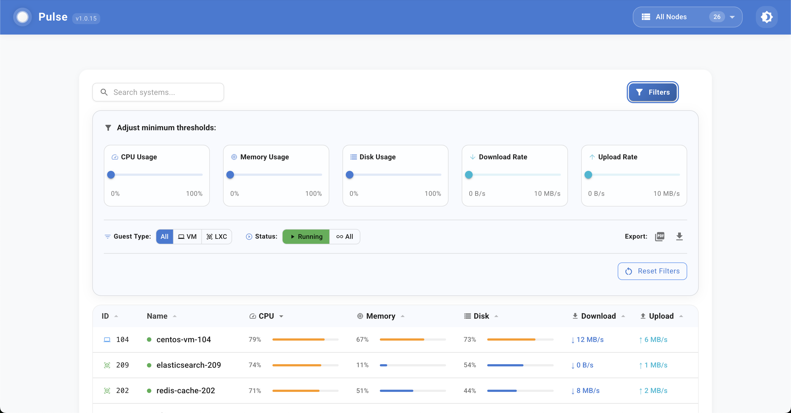

# ProxMox Pulse

A lightweight, responsive ProxMox monitoring application that displays real-time metrics for CPU, memory, network, and disk usage across multiple nodes.

## Quick Start

### 💻 Development
```bash
# 1. Clone and install
git clone https://github.com/rcourtman/pulse.git
cd pulse
npm install
cd frontend && npm install && cd ..

# 2. Copy and edit .env
cp .env.example .env
```

### 🚀 Production
```bash
# 1. Create your .env file with ProxMox configuration
cp .env.example .env
nano .env  # or use your preferred editor

# 2. Run with Docker
docker run -d \
  -p 7654:7654 \
  --env-file .env \
  --name pulse-app \
  --restart unless-stopped \
  rcourtman/pulse:latest

# 3. Access the application
open http://localhost:7654  # or visit in your browser
```

### 🐳 Docker Compose
```bash
# 1. Create your .env file with ProxMox configuration
cp .env.example .env
nano .env  # or use your preferred editor

# 2. Run with Docker Compose
docker-compose up -d

# 3. Access the application
open http://localhost:7654  # or visit in your browser
```

The Docker image is optimized for production use:
- Minimal image size with multi-stage builds
- Runs as non-root user for security
- Proper log handling and permissions
- Automatic restart on failure
- SSL/TLS support via environment variables

#### Version Information
- Latest version: 1.0.15
- Docker tags:
  - `rcourtman/pulse:latest` - Always points to the latest stable version
  - `rcourtman/pulse:1.0.15` - Specific version for reproducibility

#### Docker Tips
```bash
# View logs
docker logs pulse-app

# Restart the application
docker restart pulse-app

# Update to latest version
docker pull rcourtman/pulse:latest
docker rm -f pulse-app
docker run -d -p 7654:7654 --env-file .env --name pulse-app --restart unless-stopped rcourtman/pulse:latest

# Use a specific version
docker run -d -p 7654:7654 --env-file .env --name pulse-app --restart unless-stopped rcourtman/pulse:1.0.15
```

#### Docker Compose Tips
```bash
# View logs
docker-compose logs

# Restart the application
docker-compose restart

# Update to latest version
docker-compose pull
docker-compose up -d
```

## Features

- Real-time monitoring of ProxMox nodes, VMs, and containers
- Dashboard with summary cards for nodes, guests, and resources
- Responsive design that works on desktop and mobile
- WebSocket connection for live updates

## Screenshots

### Dashboard

*Main dashboard showing node overview and resource usage*

### Resource Details

*Detailed resource monitoring with real-time graphs*

### Mobile View

*Responsive mobile interface*

⚠️ Note: These screenshots are examples only. The actual interface may vary based on your ProxMox setup and version.

## Development

### Project Structure
```
pulse/
├── frontend/                # React frontend application
│   ├── src/
│   │   ├── components/     # React components
│   │   ├── hooks/         # Custom React hooks
│   │   ├── utils/         # Utility functions
│   │   └── styles/        # CSS and style files
│   ├── public/            # Static assets
│   └── package.json       # Frontend dependencies
│
├── src/                   # TypeScript backend application
│   ├── api/              # API route handlers
│   ├── proxmox/          # ProxMox API integration
│   ├── websocket/        # WebSocket server logic
│   ├── utils/            # Utility functions
│   └── server.ts         # Main server entry point
│
├── scripts/              # Development and utility scripts
├── .env.example         # Example environment variables
└── package.json         # Backend dependencies
```

### Available Commands
```bash
# Testing
npm run test:startup     # Run startup checks
npm run test:api         # Test ProxMox API connection
npm run lint            # Run ESLint

# Building
npm run build          # Build the TypeScript backend
```

### Versioning
The project follows semantic versioning (MAJOR.MINOR.PATCH):
- Current version: 1.0.15
- Version format: `v1.0.15` (git tags)
- Docker tags: both version-specific and `latest` are provided

## Configuration

### Environment Variables
Create a `.env` file based on `.env.example`:

```bash
# Required: ProxMox Node Configuration
PROXMOX_NODE_1_NAME=Proxmox Node 1
PROXMOX_NODE_1_HOST=https://proxmox.local:8006
PROXMOX_NODE_1_TOKEN_ID=root@pam!pulse
PROXMOX_NODE_1_TOKEN_SECRET=your-token-secret

# Optional: Additional nodes
PROXMOX_NODE_2_NAME=Proxmox Node 2
PROXMOX_NODE_2_HOST=https://proxmox2.local:8006
PROXMOX_NODE_2_TOKEN_ID=root@pam!pulse
PROXMOX_NODE_2_TOKEN_SECRET=your-token-secret

# App Configuration
PORT=7654
NODE_ENV=production
LOG_LEVEL=info
METRICS_HISTORY_MINUTES=60
NODE_POLLING_INTERVAL_MS=1000
EVENT_POLLING_INTERVAL_MS=1000
```

### ProxMox API Token Requirements
Your ProxMox API token needs these permissions:
- PVEAuditor role or custom role with:
  - Datastore.Audit
  - VM.Audit
  - Sys.Audit
  - Pool.Audit

## Troubleshooting

### Connection Issues
1. Verify your ProxMox node details in `.env`
2. Run `npm run test:api` to test the connection
3. Check if your ProxMox node is accessible
4. For SSL issues in development, set:
   ```
   IGNORE_SSL_ERRORS=true
   NODE_TLS_REJECT_UNAUTHORIZED=0
   ```

## Contributing

1. Fork the repository
2. Create a feature branch
3. Make your changes
4. Test thoroughly
5. Submit a Pull Request

## License

This project is licensed under the MIT License - see the [LICENSE](LICENSE) file for details.