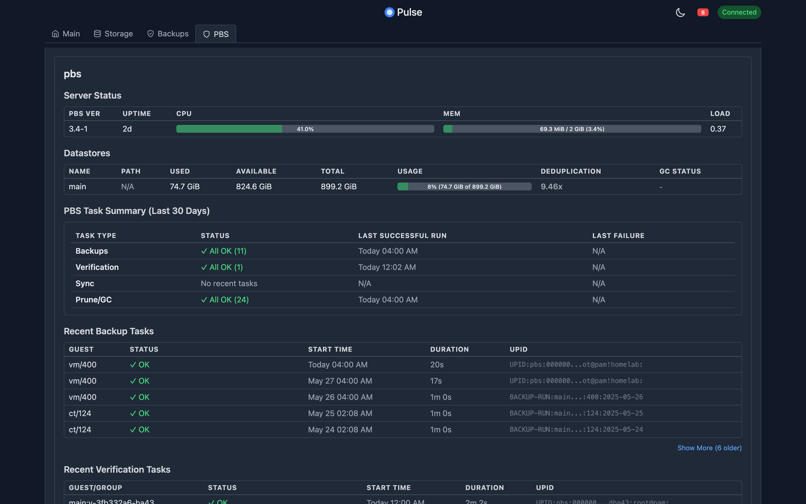
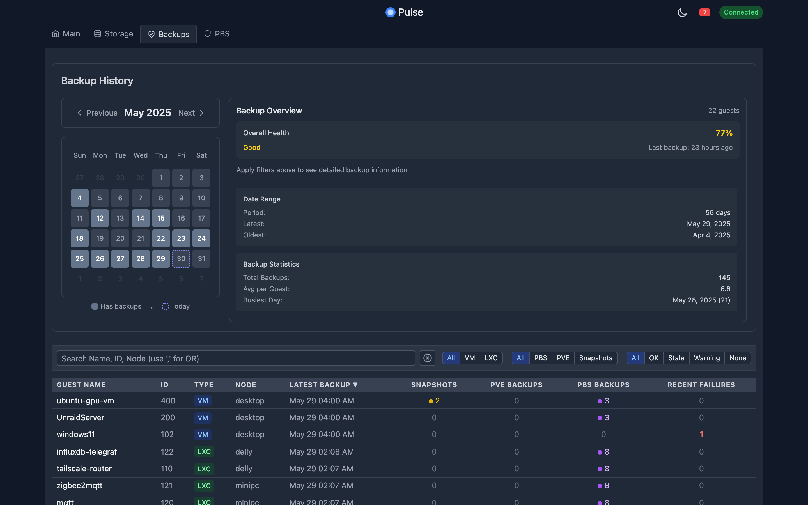
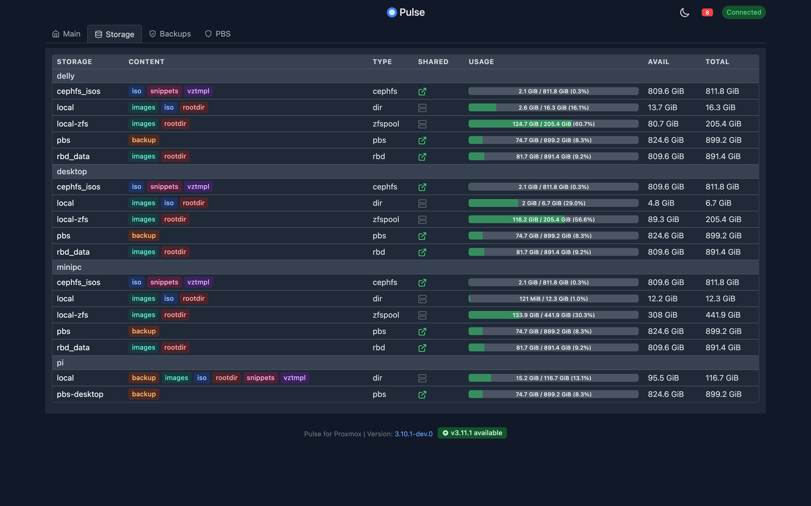
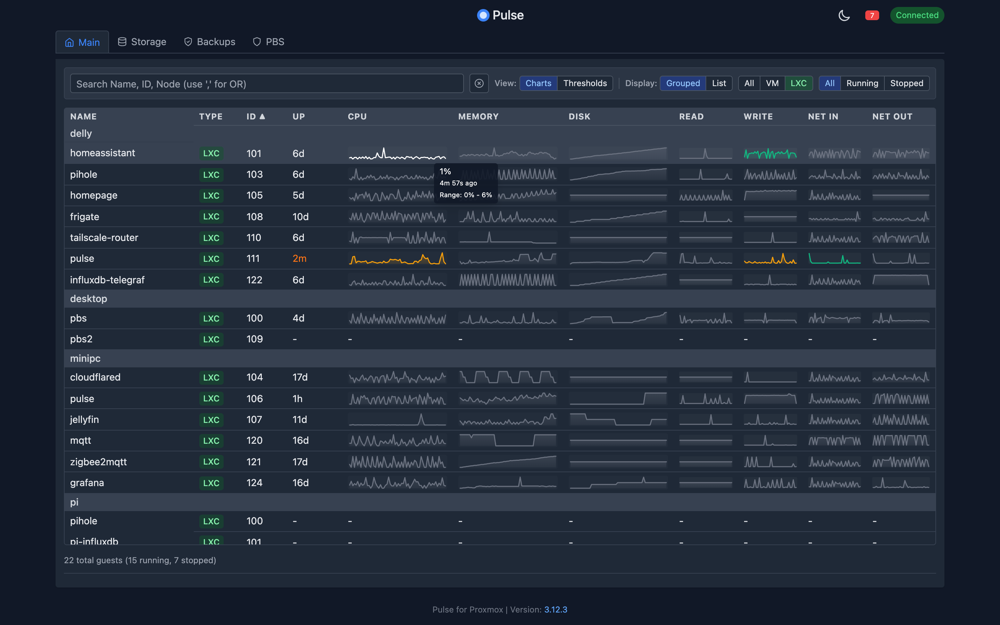
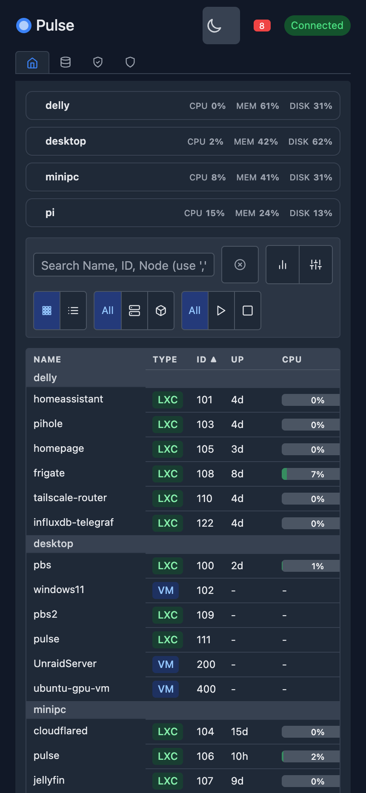
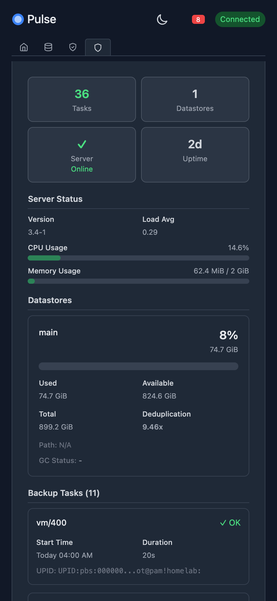
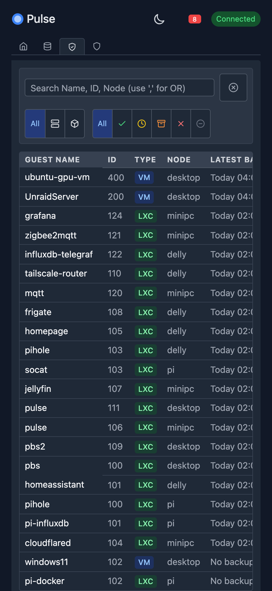

#  Pulse for Proxmox VE

[](https://github.com/rcourtman/Pulse/releases/latest)
[](LICENSE)
[](https://hub.docker.com/r/rcourtman/pulse)

A lightweight monitoring application for Proxmox VE that displays real-time status for VMs and containers via a simple web interface.


### 📸 Screenshots

<details>
<summary><strong>Click to view more screenshots</strong></summary>

**Desktop Views:**
<div align="center">
<table>
<tr>
<td align="center"><strong>PBS Tab</strong></td>
<td align="center"><strong>Backups Tab</strong></td>
</tr>
<tr>
<td></td>
<td></td>
</tr>
<tr>
<td align="center"><strong>Storage Tab</strong></td>
<td align="center"><strong>Line Graph Toggle</strong></td>
</tr>
<tr>
<td></td>
<td></td>
</tr>
</table>
</div>

**Mobile Views:**
<div align="center">
<table>
<tr>
<td align="center"><strong>Mobile Dashboard</strong></td>
<td align="center"><strong>Mobile PBS View</strong></td>
<td align="center"><strong>Mobile Backups View</strong></td>
</tr>
<tr>
<td></td>
<td></td>
<td></td>
</tr>
</table>
</div>

</details>

[](https://ko-fi.com/rcourtman)

## 🚀 Quick Start

Choose your preferred installation method:

### 📦 **Easiest: Proxmox Community Scripts (Recommended)**
**One-command installation in a new LXC container:**
```bash
bash -c "$(wget -qLO - https://github.com/community-scripts/ProxmoxVE/raw/main/ct/pulse.sh)"
```
This will create a new LXC container and install Pulse automatically. Visit the [Community Scripts page](https://community-scripts.github.io/ProxmoxVE/scripts?id=pulse) for details.

### 🐳 **Docker Compose (Pre-built Image)**
**For existing Docker hosts:**
```bash
mkdir pulse-config && cd pulse-config
# Create docker-compose.yml (see Docker section)
docker compose up -d
# Configure via web interface at http://localhost:7655
```

### 🛠️ **Manual LXC Installation**
**For existing LXC containers:**
```bash
curl -sLO https://raw.githubusercontent.com/rcourtman/Pulse/main/scripts/install-pulse.sh
chmod +x install-pulse.sh
sudo ./install-pulse.sh
```

---

## 📋 Table of Contents
- [Quick Start](#-quick-start)
- [Prerequisites](#-prerequisites)
- [Configuration](#️-configuration)
  - [Environment Variables](#environment-variables)
  - [Creating a Proxmox API Token](#creating-a-proxmox-api-token)
  - [Creating a Proxmox Backup Server API Token](#creating-a-proxmox-backup-server-api-token)
  - [Required Permissions](#required-permissions)
- [Deployment Options](#-deployment-options)
  - [Proxmox Community Scripts](#proxmox-community-scripts-automated-lxc)
  - [Docker Compose](#docker-compose-recommended-for-existing-hosts)
  - [Manual LXC Installation](#manual-lxc-installation)
  - [Development Setup](#development-setup-docker-compose)
  - [Node.js (Development)](#️-running-the-application-nodejs-development)
- [Features](#-features)
- [System Requirements](#-system-requirements)
- [Updating Pulse](#-updating-pulse)
- [Contributing](#-contributing)
- [Privacy](#-privacy)
- [License](#-license)
- [Trademark Notice](#trademark-notice)
- [Support](#-support)
- [Troubleshooting](#-troubleshooting)

## ✅ Prerequisites

Before installing Pulse, ensure you have:

**For Proxmox VE:**
- [ ] Proxmox VE 7.x or 8.x running
- [ ] Admin access to create API tokens
- [ ] Network connectivity between Pulse and Proxmox (ports 8006/8007)

**For Pulse Installation:**
- [ ] **Community Scripts**: Just a Proxmox host (handles everything automatically)
- [ ] **Docker**: Docker & Docker Compose installed
- [ ] **Manual LXC**: Existing Debian/Ubuntu LXC with internet access

---

## 🚀 Deployment Options

### Proxmox Community Scripts (Automated LXC)

**✨ Easiest method - fully automated LXC creation and setup:**

```bash
bash -c "$(wget -qLO - https://github.com/community-scripts/ProxmoxVE/raw/main/ct/pulse.sh)"
```

This script will:
- Create a new LXC container automatically
- Install all dependencies (Node.js, npm, etc.)
- Download and set up Pulse
- Set up systemd service

**After installation:** Access Pulse at `http://<lxc-ip>:7655` and configure via the web interface

Visit the [Community Scripts page](https://community-scripts.github.io/ProxmoxVE/scripts?id=pulse) for more details.

---

### Docker Compose (Recommended for Existing Hosts)

**For existing Docker hosts - uses pre-built image:**

**Prerequisites:**
- Docker ([Install Docker](https://docs.docker.com/engine/install/))
- Docker Compose ([Install Docker Compose](https://docs.docker.com/compose/install/))

**Steps:**

1.  **Create a Directory:** Make a directory for your Docker configuration files:
    ```bash
    mkdir pulse-config
    cd pulse-config
    ```
2.  **Create `docker-compose.yml` file:** Create a file named `docker-compose.yml` in this directory with the following content:
    ```yaml
    # docker-compose.yml
    services:
      pulse-server:
        image: rcourtman/pulse:latest # Pulls the latest pre-built image
        container_name: pulse
        restart: unless-stopped
        ports:
          # Map host port 7655 to container port 7655
          # Change the left side (e.g., "8081:7655") if 7655 is busy on your host
          - "7655:7655"
        volumes:
          # Persistent volume for configuration data
          # Configuration persists across container updates
          - pulse_config:/usr/src/app/config

    # Define persistent volumes
    volumes:
      pulse_config:
        driver: local
    ```
3.  **Run:** Start the container:
    ```bash
    docker compose up -d
    ```
4.  **Access and Configure:** Open your browser to `http://<your-docker-host-ip>:7655` and configure through the web interface.

---

### Manual LXC Installation

**For existing Debian/Ubuntu LXC containers:**

**Prerequisites:**
- A running Proxmox VE host
- An existing Debian or Ubuntu LXC container with network access to Proxmox
    - *Tip: Use [Community Scripts](https://community-scripts.github.io/ProxmoxVE/scripts?id=debian) to easily create one: `bash -c "$(curl -fsSL https://raw.githubusercontent.com/community-scripts/ProxmoxVE/main/ct/debian.sh)"`*

**Steps:**

1.  **Access LXC Console:** Log in to your LXC container (usually as `root`).
2.  **Download and Run Script:**
    ```bash
    # Ensure you are in a suitable directory, like /root or /tmp
    curl -sLO https://raw.githubusercontent.com/rcourtman/Pulse/main/scripts/install-pulse.sh
    chmod +x install-pulse.sh
    ./install-pulse.sh
    ```
3.  **Follow Prompts:** The script guides you through:
    *   Installing dependencies (`git`, `curl`, `nodejs`, `npm`, `sudo`).
    *   Setting up Pulse as a `systemd` service (`pulse-monitor.service`).
    *   Optionally enabling automatic updates via cron.
4.  **Access and Configure:** The script will display the URL (e.g., `http://<LXC-IP-ADDRESS>:7655`). Open this URL and configure via the web interface.

For update instructions, see the [Updating Pulse](#-updating-pulse) section.

---

### Development Setup (Docker Compose)

Use this method if you have cloned the repository and want to build and run the application from the local source code.

1.  **Get Files:** Clone the repository (`git clone https://github.com/rcourtman/Pulse.git && cd Pulse`)
2.  **Run:** `docker compose up --build -d` (The included `docker-compose.yml` uses the `build:` context by default).
3.  **Access and Configure:** Open your browser to `http://localhost:7655` (or your host IP if Docker runs remotely) and configure via the web interface.

## 🛠️ Configuration

Pulse features a comprehensive web-based configuration system accessible through the settings menu. No manual file editing required!

### Web Interface Configuration (Recommended)

**First-time Setup:**
- Access Pulse at `http://your-host:7655`
- The settings modal will automatically open for initial configuration
- Configure all your Proxmox VE and PBS servers through the intuitive web interface
- Test connections with built-in connectivity verification
- Save and reload configuration without restarting the application

**Ongoing Management:**
- Click the settings icon (⚙️) in the top-right corner anytime
- Add/modify multiple PVE and PBS endpoints
- Configure alert thresholds and service intervals
- All changes are applied immediately

### Environment Variables (Advanced/Development)

For advanced users or development setups, Pulse can also be configured using environment variables in a `.env` file.

#### Proxmox VE (Primary Environment)

These are the minimum required variables:
-   `PROXMOX_HOST`: URL of your Proxmox server (e.g., `https://192.168.1.10:8006`).
-   `PROXMOX_TOKEN_ID`: Your API Token ID (e.g., `user@pam!tokenid`).
-   `PROXMOX_TOKEN_SECRET`: Your API Token Secret.

Optional variables:
-   `PROXMOX_NODE_NAME`: A display name for this endpoint in the UI (defaults to `PROXMOX_HOST`).
-   `PROXMOX_ALLOW_SELF_SIGNED_CERTS`: Set to `true` if your Proxmox server uses self-signed SSL certificates. Defaults to `false`.
-   `PORT`: Port for the Pulse server to listen on. Defaults to `7655`.
-   `BACKUP_HISTORY_DAYS`: Number of days of backup history to display (defaults to `365` for full year calendar view).
-   *(Username/Password fallback exists but API Token is strongly recommended)*

#### Alert System Configuration (Optional)

Pulse includes a comprehensive alert system that monitors resource usage and system status:

```env
# Alert System Configuration
ALERT_CPU_ENABLED=true
ALERT_MEMORY_ENABLED=true
ALERT_DISK_ENABLED=true
ALERT_DOWN_ENABLED=true

# Alert thresholds (percentages)
ALERT_CPU_THRESHOLD=85
ALERT_MEMORY_THRESHOLD=90
ALERT_DISK_THRESHOLD=95

# Alert durations (milliseconds - how long condition must persist)
ALERT_CPU_DURATION=300000       # 5 minutes
ALERT_MEMORY_DURATION=300000    # 5 minutes  
ALERT_DISK_DURATION=600000      # 10 minutes
ALERT_DOWN_DURATION=60000       # 1 minute
```

Alert features include:
- Real-time notifications with toast messages
- Multi-severity alerts (Critical, Warning, Resolved)
- Duration-based triggering (alerts only fire after conditions persist)
- Automatic resolution when conditions normalize
- Alert history tracking

***Note:** For a Proxmox cluster, you only need to provide connection details for **one** node. Pulse automatically discovers other cluster members.*


#### Multiple Proxmox Environments (Optional)

To monitor separate Proxmox environments (e.g., different clusters, sites) in one Pulse instance, add numbered variables:

-   `PROXMOX_HOST_2`, `PROXMOX_TOKEN_ID_2`, `PROXMOX_TOKEN_SECRET_2`
-   `PROXMOX_HOST_3`, `PROXMOX_TOKEN_ID_3`, `PROXMOX_TOKEN_SECRET_3`
-   ...and so on.

Optional numbered variables also exist (e.g., `PROXMOX_ALLOW_SELF_SIGNED_CERTS_2`, `PROXMOX_NODE_NAME_2`).

#### Proxmox Backup Server (PBS) (Optional)

To monitor PBS instances:

**Primary PBS Instance:**
-   `PBS_HOST`: URL of your PBS server (e.g., `https://192.168.1.11:8007`).
-   `PBS_TOKEN_ID`: Your PBS API Token ID (e.g., `user@pbs!tokenid`). See [Creating a Proxmox Backup Server API Token](#creating-a-proxmox-backup-server-api-token).
-   `PBS_TOKEN_SECRET`: Your PBS API Token Secret.
-   `PBS_NODE_NAME`: **Important!** The internal hostname of your PBS server (e.g., `pbs-server-01`). This is usually required for API token auth because the token might lack permission to auto-discover the node name. See details below.
-   `PBS_ALLOW_SELF_SIGNED_CERTS`: Set to `true` for self-signed certificates. Defaults to `false`.
-   `PBS_PORT`: PBS API port. Defaults to `8007`.

**Additional PBS Instances:**

To monitor multiple PBS instances, add numbered variables, starting with `_2`:

-   `PBS_HOST_2`, `PBS_TOKEN_ID_2`, `PBS_TOKEN_SECRET_2`
-   `PBS_HOST_3`, `PBS_TOKEN_ID_3`, `PBS_TOKEN_SECRET_3`
-   ...and so on.

Optional numbered variables also exist for additional PBS instances (e.g., `PBS_NODE_NAME_2`, `PBS_ALLOW_SELF_SIGNED_CERTS_2`, `PBS_PORT_2`). Each PBS instance, whether primary or additional, requires its respective `PBS_NODE_NAME` or `PBS_NODE_NAME_n` to be set if API token authentication is used and the token cannot automatically discover the node name.

<details>
<summary><strong>Why <code>PBS_NODE_NAME</code> (or <code>PBS_NODE_NAME_n</code>) is Required (Click to Expand)</strong></summary>

Pulse needs to query task lists specific to the PBS node (e.g., `/api2/json/nodes/{nodeName}/tasks`). It attempts to discover this node name automatically by querying `/api2/json/nodes`. However, this endpoint is often restricted for API tokens (returning a 403 Forbidden error), even for tokens with high privileges, unless the `Sys.Audit` permission is granted on the root path (`/`).

Therefore, **setting `PBS_NODE_NAME` in your `.env` file is the standard and recommended way** to ensure Pulse can correctly query task endpoints when using API token authentication. If it's not set and automatic discovery fails due to permissions, Pulse will be unable to fetch task data (backups, verifications, etc.).

**How to find your PBS Node Name:**
1.  **SSH:** Log into your PBS server via SSH and run `hostname`.
2.  **UI:** Log into the PBS web interface. The hostname is typically displayed on the Dashboard under Server Status.

Example: If your PBS connects via `https://minipc-pbs.lan:8007` but its internal hostname is `proxmox-backup-server`, set:
```env
PBS_HOST=https://minipc-pbs.lan:8007
PBS_NODE_NAME=proxmox-backup-server
```
</details>

### Creating a Proxmox API Token

Using an API token is the recommended authentication method.

<details>
<summary><strong>Steps to Create a PVE API Token (Click to Expand)</strong></summary>

1.  **Log in to the Proxmox VE web interface.**
2.  **Create a dedicated user** (optional but recommended):
    *   Go to `Datacenter` → `Permissions` → `Users`.
    *   Click `Add`. Enter a `User name` (e.g., "pulse-monitor"), set Realm to `Proxmox VE authentication server` (`pam`), set a password, ensure `Enabled`. Click `Add`.
3.  **Create an API token:**
    *   Go to `Datacenter` → `Permissions` → `API Tokens`.
    *   Click `Add`.
    *   Select the `User` (e.g., "pulse-monitor@pam") or `root@pam`.
    *   Enter a `Token ID` (e.g., "pulse").
    *   Leave `Privilege Separation` checked. Click `Add`.
    *   **Important:** Copy the `Secret` value immediately. It's shown only once.
4.  **Assign permissions (to User and Token):**
    *   Go to `Datacenter` → `Permissions`.
    *   **Add User Permission:** Click `Add` → `User Permission`. Path: `/`, User: `pulse-monitor@pam`, Role: `PVEAuditor`, check `Propagate`. Click `Add`.
    *   **Add Token Permission:** Click `Add` → `API Token Permission`. Path: `/`, API Token: `pulse-monitor@pam!pulse`, Role: `PVEAuditor`, check `Propagate`. Click `Add`.
    *   *Note: The `PVEAuditor` role at the root path (`/`) with `Propagate` is crucial.*
5.  **Update `.env`:** Set `PROXMOX_TOKEN_ID` (e.g., `pulse-monitor@pam!pulse`) and `PROXMOX_TOKEN_SECRET` (the secret you copied).

</details>

### Creating a Proxmox Backup Server API Token

If monitoring PBS, create a token within the PBS interface.

<details>
<summary><strong>Steps to Create a PBS API Token (Click to Expand)</strong></summary>

1.  **Log in to the Proxmox Backup Server web interface.**
2.  **Create a dedicated user** (optional but recommended):
    *   Go to `Configuration` → `Access Control` → `User Management`.
    *   Click `Add`. Enter `User ID` (e.g., "pulse-monitor@pbs"), set Realm (likely `pbs`), add password. Click `Add`.
3.  **Create an API token:**
    *   Go to `Configuration` → `Access Control` → `API Token`.
    *   Click `Add`.
    *   Select `User` (e.g., "pulse-monitor@pbs") or `root@pam`.
    *   Enter `Token Name` (e.g., "pulse").
    *   Leave `Privilege Separation` checked. Click `Add`.
    *   **Important:** Copy the `Secret` value immediately.
4.  **Assign permissions (to User and Token):**
    *   Go to `Configuration` → `Access Control` → `Permissions`.
    *   **Add User Permission:** Click `Add` → `User Permission`. Path: `/`, User: `pulse-monitor@pbs`, Role: `Audit`, check `Propagate`. Click `Add`.
    *   **Add API Token Permission:** Click `Add` → `API Token Permission`. Path: `/`, API Token: `pulse-monitor@pbs!pulse`, Role: `Audit`, check `Propagate`. Click `Add`.
    *   *Note: The `Audit` role at root path (`/`) with `Propagate` is crucial for both user and token.*
5.  **Update `.env`:** Set `PBS_TOKEN_ID` (e.g., `pulse-monitor@pbs!pulse`) and `PBS_TOKEN_SECRET`.

</details>

### Required Permissions

-   **Proxmox VE:** 
    - **Basic monitoring:** The `PVEAuditor` role assigned at path `/` with `Propagate` enabled.
    - **To view PVE backup files:** Additionally requires `PVEDatastoreAdmin` role on `/storage` (or specific storage paths).
    
    <details>
    <summary>Important: Storage Content Visibility (Click to Expand)</summary>
    
    Due to Proxmox API limitations, viewing backup files in storage requires elevated permissions:
    - `PVEAuditor` alone is NOT sufficient to list storage contents via API
    - You must grant `PVEDatastoreAdmin` role which includes `Datastore.Allocate` permission
    - This applies even for read-only access to backup listings
    
    To fix empty PVE backup listings:
    ```bash
    # Grant storage admin permissions to your API token
    pveum acl modify /storage --tokens user@realm!tokenname --roles PVEDatastoreAdmin
    ```
    </details>
    
    <details>
    <summary>Permissions included in PVEAuditor (Click to Expand)</summary>
    - `Datastore.Audit`
    - `Permissions.Read` (implicitly included)
    - `Pool.Audit`
    - `Sys.Audit`
    - `VM.Audit`
    </details>
    
-   **Proxmox Backup Server:** The `Audit` role assigned at path `/` with `Propagate` enabled is recommended.

### Running from Release Tarball

For users who prefer not to use Docker or the LXC script, pre-packaged release tarballs are available.

**Prerequisites:**
- Node.js (Version 18.x or later recommended)
- npm (comes with Node.js)
- `tar` command (standard on Linux/macOS, available via tools like 7-Zip or WSL on Windows)

**Steps:**

1.  **Download:** Go to the [Pulse GitHub Releases page](https://github.com/rcourtman/Pulse/releases/latest). Download the `pulse-vX.Y.Z.tar.gz` file for the desired release.
2.  **Extract:** Create a directory and extract the tarball:
    ```bash
    mkdir pulse-app
    cd pulse-app
    tar -xzf /path/to/downloaded/pulse-vX.Y.Z.tar.gz
    # This creates a directory like pulse-vX.Y.Z/
    cd pulse-vX.Y.Z
    ```
3.  **Run:** Start the application using npm:
    ```bash
    npm start
    ```
    *(Note: The tarball includes pre-installed production dependencies, so `npm install` is not typically required unless you encounter issues.)*
4.  **Access and Configure:** Open your browser to `http://<your-server-ip>:7655` and configure via the web interface.

### ️ Running the Application (Node.js - Development)

For development purposes or running directly from source, see the **[DEVELOPMENT.md](DEVELOPMENT.md)** guide. This involves cloning the repository, installing dependencies using `npm install` in both the root and `server` directories, and running `npm run dev` or `npm run start`.

## ✨ Features

- Lightweight monitoring for Proxmox VE nodes, VMs, and Containers.
- Real-time status updates via WebSockets.
- Simple, responsive web interface.
- **Comprehensive backup monitoring:**
  - Proxmox Backup Server (PBS) snapshots and tasks
  - PVE backup files stored on local and shared storage
  - VM/CT snapshot tracking with calendar heatmap visualization
- Built-in diagnostic tool with API permission testing and troubleshooting guidance.
- Advanced alert system with configurable thresholds and durations.
- Efficient polling: Stops API polling when no clients are connected.
- Docker support.
- Multi-environment PVE monitoring support.
- LXC installation script.

## 💻 System Requirements

- **Node.js:** Version 18.x or later (if building/running from source).
- **NPM:** Compatible version with Node.js.
- **Docker & Docker Compose:** Latest stable versions (if using container deployment).
- **Proxmox VE:** Version 7.x or 8.x recommended.
- **Proxmox Backup Server:** Version 2.x or 3.x recommended (if monitored).
- **Web Browser:** Modern evergreen browser.

## 🔄 Updating Pulse

### Web-Based Updates (Non-Docker)

For non-Docker installations, Pulse includes a built-in update mechanism:

1. Open the Settings modal (gear icon in the top right)
2. Scroll to the "Software Updates" section
3. Click "Check for Updates"
4. If an update is available, review the release notes
5. Click "Apply Update" to install it automatically

The update process:
- Backs up your configuration files
- Downloads and applies the update
- Preserves your settings
- Automatically restarts the application

### Community Scripts LXC Installation

If you installed using the Community Scripts method, simply re-run the original installation command:

```bash
bash -c "$(wget -qLO - https://github.com/community-scripts/ProxmoxVE/raw/main/ct/pulse.sh)"
```

The script will detect the existing installation and update it automatically.

### Docker Compose Installation

Docker deployments must be updated by pulling the new image:

```bash
cd /path/to/your/pulse-config
docker compose pull
docker compose up -d
```

This pulls the latest image and recreates the container with the new version.

**Note:** The web-based update feature will detect Docker deployments and provide these instructions instead of attempting an in-place update.

### Manual LXC Installation

If you used the manual installation script, update by re-running it:

```bash
# Navigate to where you downloaded the script
cd /path/to/script/directory
./install-pulse.sh
```

Or run non-interactively (useful for automated updates):

```bash
./install-pulse.sh --update
```

**Managing the Service:**
- Check status: `sudo systemctl status pulse-monitor.service`
- View logs: `sudo journalctl -u pulse-monitor.service -f`
- Restart: `sudo systemctl restart pulse-monitor.service`

**Automatic Updates:**
If you enabled automatic updates during installation, they run via cron. Check logs in `/var/log/pulse_update.log`.

### Release Tarball Installation

To update a tarball installation:

1. Download the latest release from [GitHub Releases](https://github.com/rcourtman/Pulse/releases/latest)
2. Stop the current application
3. Extract the new tarball to a new directory
4. Start the application: `npm start`
5. Your configuration will be preserved automatically

### Development/Source Installation

If running from source code:

```bash
cd /path/to/pulse
git pull origin main
npm install
npm run build:css
npm run start    # or your preferred restart method
```

**Note:** The development setup only requires npm install in the root directory, not in a separate server directory.

## 📝 Contributing

Contributions are welcome! Please read our [Contributing Guidelines](CONTRIBUTING.md).

## 🔒 Privacy

*   **No Data Collection:** Pulse does not collect or transmit any telemetry or user data externally.
*   **Local Communication:** Operates entirely between your environment and your Proxmox/PBS APIs.
*   **Credential Handling:** Credentials are used only for API authentication and are not logged or sent elsewhere.

## 📜 License

This project is licensed under the MIT License - see the [LICENSE](LICENSE) file.

## ™️ Trademark Notice

Proxmox® and Proxmox VE® are registered trademarks of Proxmox Server Solutions GmbH. This project is not affiliated with or endorsed by Proxmox Server Solutions GmbH.

## ❤️ Support

File issues on the [GitHub repository](https://github.com/rcourtman/Pulse/issues).

If you find Pulse useful, consider supporting its development:
[](https://ko-fi.com/rcourtman)

## ❓ Troubleshooting

### 🔧 Quick Fixes

**Can't access Pulse after installation?**
```bash
# Check if service is running
sudo systemctl status pulse-monitor.service

# Check what's listening on port 7655
sudo netstat -tlnp | grep 7655

# View recent logs
sudo journalctl -u pulse-monitor.service -f
```

**Empty dashboard or "No data" errors?**
1. **Check API Token:** Verify your `PROXMOX_TOKEN_ID` and `PROXMOX_TOKEN_SECRET` are correct
2. **Test connectivity:** Can you ping your Proxmox host from where Pulse is running?
3. **Check permissions:** Ensure token has `PVEAuditor` role on path `/` with `Propagate` enabled

**"Empty Backups Tab" with PBS configured?**
- Ensure `PBS Node Name` is configured in the settings modal
- Find hostname with: `ssh root@your-pbs-ip hostname`

**Docker container won't start?**
```bash
# Check container logs
docker logs pulse

# Restart container
docker compose down && docker compose up -d
```

### Diagnostic Tool

Pulse includes a comprehensive built-in diagnostic tool to help troubleshoot configuration and connectivity issues:

**Web Interface (Recommended):**
- The diagnostics icon appears automatically in the header when issues are detected
- Click the icon or navigate to `http://your-pulse-host:7655/diagnostics.html`
- The tool will automatically run diagnostics and provide:
  - **API Token Permission Testing** - Tests actual API permissions for VMs, containers, nodes, and datastores
  - **Configuration Validation** - Verifies all connection settings and required parameters
  - **Real-time Connectivity Tests** - Tests live connections to Proxmox VE and PBS instances
  - **Data Flow Analysis** - Shows discovered nodes, VMs, containers, and backup data
  - **Specific Actionable Recommendations** - Detailed guidance for fixing any issues found

**Key Features:**
- Tests use the same API endpoints as the main application for accuracy
- Provides exact permission requirements (e.g., `VM.Audit` on `/` for Proxmox)
- Shows counts of discovered resources (VMs, containers, nodes, backups)
- Identifies common misconfigurations like missing `PBS_NODE_NAME`
- **Privacy Protected**: Automatically sanitizes hostnames, IPs, and sensitive data before export
- Export diagnostic reports safe for sharing in GitHub issues or support requests

**Command Line:**
```bash
# If using the source code:
./scripts/diagnostics.sh

# The script will generate a detailed report and save it to a timestamped file
```

### Common Issues

*   **Empty Backups Tab:** 
    - **PBS backups not showing:** Usually caused by missing `PBS Node Name` in the settings configuration. SSH to your PBS server and run `hostname` to find the correct value.
    - **PVE backups not showing:** Ensure your API token has `PVEDatastoreAdmin` role on `/storage` to view backup files. See the permissions section above.
*   **Pulse Application Logs:** Check container logs (`docker logs pulse_monitor`) or service logs (`sudo journalctl -u pulse-monitor.service -f`) for errors (401 Unauthorized, 403 Forbidden, connection refused, timeout).
*   **Configuration Issues:** Use the settings modal to verify all connection details. Test connections with the built-in connectivity tester before saving. Ensure no placeholder values remain.
*   **Network Connectivity:** Can the machine running Pulse reach the PVE/PBS hostnames/IPs and ports (usually 8006 for PVE, 8007 for PBS)? Check firewalls.
*   **API Token Permissions:** Ensure the correct roles (`PVEAuditor` for PVE, `Audit` for PBS) are assigned at the root path (`/`) with `Propagate` enabled in the respective UIs.
